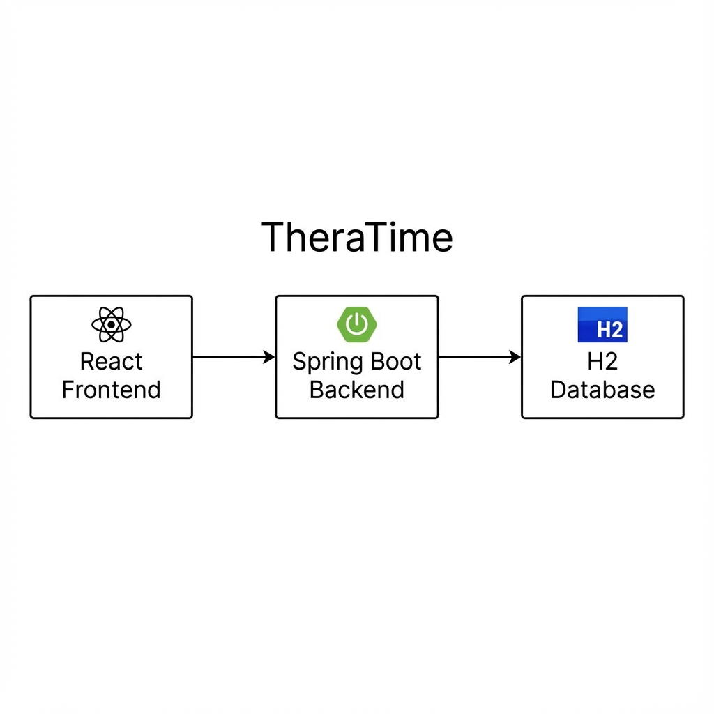

# TheraTime ⏳

> **Bridging the gap between manual time entry and seamless payroll.**

[](https://thera-time.vercel.app/)
[](https://github.com/kripanshu-singh/TheraTime)
[](https://github.com/kripanshu-singh/TheraTime)

---

## 🧐 Why TheraTime?

I studied user reviews and discovered a critical friction point: **Thera still requires clients to manually input time & attendance data before payroll can run.**

This manual step is error-prone, time-consuming, and disconnects the actual work from the payment process.

**TheraTime fills this exact gap.** It is a microservice where:
1.  **Contractors** log their hours directly.
2.  **Managers** review and approve timesheets in real-time.
3.  The service automatically generates a **ready-to-sync payroll payload** (JSON) that can be consumed by the main payroll engine.

It is built using the same robust stack as Thera (**Java + Spring Boot + React**) to ensure seamless integration potential.

---

## 🏗️ Architecture

TheraTime follows a clean **Client-Server** architecture designed for scalability and ease of deployment.



### Tech Stack
-   **Frontend**: React, Vite, Material UI (MUI)
-   **Backend**: Java 17, Spring Boot 3
-   **Database**: H2 (In-Memory for speed/demo), JPA/Hibernate
-   **Deployment**: Render (Backend), Vercel (Frontend)

---

## 🚀 How to Run Locally

### Prerequisites
-   Node.js & npm
-   Java 17+ (JDK)

### 1. Clone the Repository
```bash
git clone https://github.com/kripanshu-singh/TheraTime.git
cd TheraTime
```

### 2. Start the Backend
The backend runs on port `8082`.
```bash
cd backend
./mvnw spring-boot:run
```

### 3. Start the Frontend
The frontend runs on port `5173`.
```bash
cd frontend
npm install
npm run dev
```

Visit `http://localhost:5173` to view the app.

> **Note**: The app comes pre-loaded with two users:
> - **Contractor**: `kripanshu@example.com`
> - **Manager**: `akhil@getthera.com`

---

## 🔌 API Endpoints

The backend exposes a RESTful API for all operations.

| Method | Endpoint | Description |
| :--- | :--- | :--- |
| **Auth** | | |
| `POST` | `/api/auth/login` | Login with email (returns User object) |
| **Timesheets** | | |
| `POST` | `/api/timesheets/submit/{userId}` | Submit a new timesheet entry |
| `GET` | `/api/timesheets/user/{userId}` | Get history for a specific contractor |
| `GET` | `/api/timesheets/pending` | Get all timesheets awaiting approval |
| `POST` | `/api/timesheets/approve/{id}` | Approve a specific timesheet |
| **Payroll** | | |
| `GET` | `/api/payroll/generate` | Generate the final payroll JSON payload |

---

## 🔮 Future Improvements

To make TheraTime production-ready for enterprise scale:

1.  **Persistent Database**: Migrate from H2 to **PostgreSQL** for long-term data storage.
2.  **Authentication**: Implement **JWT (JSON Web Tokens)** for secure, stateless authentication.
3.  **Export Options**: Add functionality to export the payroll payload as **CSV** or **PDF** for legacy systems.
4.  **Notifications**: Integrate **Slack/Email notifications** when a timesheet is submitted or approved.
5.  **CI/CD**: Set up GitHub Actions for automated testing and deployment pipelines.

---

Made with ❤️ by [Kripanshu Singh](https://kripanshu.me)
